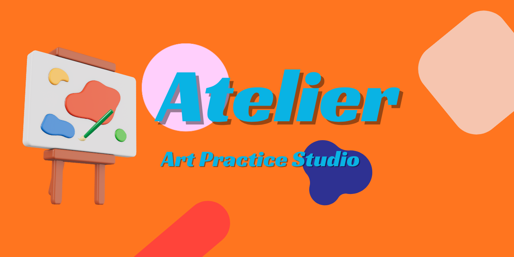

<p align="center">
  
</p>

<h1 align="center">🎨 Atelier — Art Practice Studio</h1>

<p align="center">
  <em>A complete front-end art practice tool. No backend, no accounts — runs entirely in the browser.</em>
</p>

<p align="center">
  <a href="https://atelier-mu-ten.vercel.app">
    
  </a>
  <a href="#">
    
  </a>
  <a href="#">
    
  </a>
</p>

<p align="center">
  
  
  
  
</p>

---

## ✨ Features

<table>
  <tr>
    <td width="33%" align="center">
      <strong>⏱️ Gesture Timer</strong><br>
      Countdown with random pose prompts and audio ping
    </td>
    <td width="33%" align="center">
      <strong>✏️ Warm-Up Drills</strong><br>
      Drawable canvases for lines, circles, ellipses, hatching, boxes
    </td>
    <td width="33%" align="center">
      <strong>📐 Perspective Grid</strong><br>
      1pt / 2pt / 3pt grids with draggable vanishing points
    </td>
  </tr>
  <tr>
    <td width="33%" align="center">
      <strong>🎨 Color Practice</strong><br>
      Palette generator and RGB color mixer with scoring
    </td>
    <td width="33%" align="center">
      <strong>⚫ Value Scale</strong><br>
      Match grayscale targets with instant feedback
    </td>
    <td width="33%" align="center">
      <strong>📊 Practice Log</strong><br>
      Sessions, skills, ratings, streak, heatmap, badges
    </td>
  </tr>
</table>

<p align="center">
  <strong>📋 Dashboard</strong> — Daily challenges, stats, quick access to all tools
</p>

---

## 🛠️ Tech Stack

<table>
  <tr>
    <td><strong>Frontend</strong></td>
    <td>Plain HTML + CSS + JavaScript</td>
  </tr>
  <tr>
    <td><strong>Drawing</strong></td>
    <td>Canvas API</td>
  </tr>
  <tr>
    <td><strong>Persistence</strong></td>
    <td>LocalStorage</td>
  </tr>
  <tr>
    <td><strong>Deployment</strong></td>
    <td><a href="https://vercel.com">Vercel</a></td>
  </tr>
</table>

---

## 🚀 Quick Start

**Local Development**
```bash
# No build step needed — just open in your browser!
open index.html
